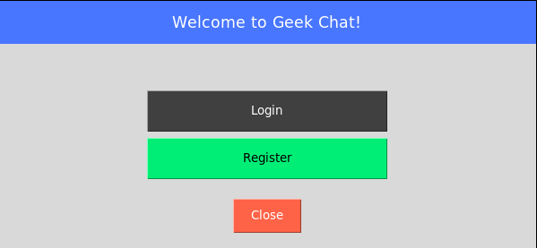
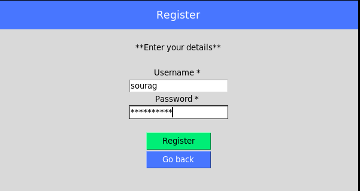
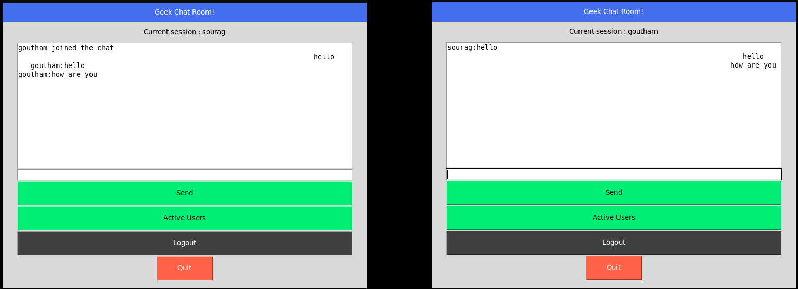
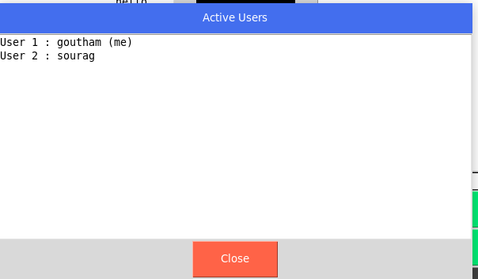

# MultiuserChat

A client server application with Login and Registration Functionality.
Some features are yet to be tested.
Server uses 2 children per client. One to receive message and one to send.
Client uses a seperate thread to wait for a message from server and then
updates the chat window.

### Usage

Make sure requirements is satisfied.

```
make
./server
python3 client.py
```

### Scrshots

Image of the welcome screen.  


Register screen. Login screen also looks similar.  


Two people chatting.  


Active users window.  

